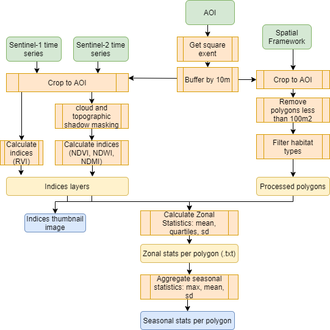

```{r setup, include=FALSE}
knitr::opts_chunk$set(echo = TRUE)


```

<div class="mycontent">

This walkthrough takes you through the processes of detecting habitat changes in Sentinel-1 and 2 time series data using a defined spatial framework. This follows the steps highlighted in the diagram below:



## Create site AOI

```{r aoigridsquare}
dirpath <- 'filepath/'

```

## Prepare the spatial framework polygons

## Zonal_stats function

The zonal_stats() function calculates the zonal statistics for s1 and s2 indices using a polygon shapefile to determine zones. This function takes as inputs the polygon layer and locations of folders containing the s1 and s2 imagery.

```{r zonalstats, eval=F}

## take the polygon shapefile
zonal_stats(polys=paste0(dirpath,"living_map/Living_Maps_Landscape_20170929_10km.shp"),
            s2path=paste0(dirpath,"s2/"),
            s1path=paste0(dirpath,'s1/Sentinel1ARD/'),
            outfolder=paste0(dirpath),
            sitename="Devon")

```
This function contains these steps:

### Masking the Sentinel-2 granules

The S2 imagery is downloaded with 3 files:
* cloud image
* shadow image
* the ard imagery layer

The beginning of the zonal_stats function finds the matching downloaded S2 layers with the same date and then masks the cloud and shadow from the imagery layer, replacing these with NA values.

### Calculating indices

For the sentinel-2 imagery, this calls the runIndices() function, which iterates through a folder of imagery and calculate indices based on the band numbers provided in the arguments (r,b,g,nir,swir). For this project we are interested in the following indices with Sentinel-2 imagery:

* NDVI - Normalised Difference Vegetation Index - (nir-r/nir+r)
* NDWI - Normalized Difference Water Index - (g-nir/g+nir)
* NDMI - Normalized Difference Moisture Index - (nir-swir/nir+swir)


```{r indicescal,eval=F}
#called within the zonal_stats() function..
runIndices(imagepath=paste0(dirpath, "s2/masked"), 
           outpath=paste0(dirpath,"s2"), nir=8,r=3, b=1, g=2, swir=9,
           indices=c("NDVI","NDWI","NDMI"), 
           nf=F)

```

For the Sentinel-1 imagery, we are interested in the index:
- RVI - Radar Vegetation Index - (4 * VH) / (VV + VH) in linear power not dB.

```{r s1indices,eval=F}
#called within the zonal_stats() function..
s1path <- 's1/'
runS1Indices(imagepath=paste0(s1path,'Sentinel1ARD'), 
             outpath=paste0(s1path), 
             vv=1, vh=2, 
             indices=c('RVI','RVIv'))

```

This is called in the zonal_stats function by calling ...

### Creating thumbnail image

This is a square thumbnail image of the indices layer to be displayed in the app with notation of the date and index in the bottom corner. Here the colour stretching is fixed for each indices:

* NDVI displayed between 0 and 1
* NDWI displayed between -1 and 0 
* NDMI displayed between -1 and 1
* RVI displayed between -1000 and 5000 (need to revise)
* RVIv displayed between -200 and 500 (need to revise)


### Extracting zonal statistics

After the indices layers are calculated, the function iterates through each image stacking the indices into a rasterstack. The polygon layer is rasterized to the same extent and resolution as the imagery and then added to the rasterstack. Finally the raster::zonal() function is called to calculate the statistics for each zone in the polygon raster. 

Where na values are present within a polygon in any of the indices layers, the polygon id is removed for that image as we are unable to calculate a complete measure due to masked areas.

The statistics for each image are all combined in a table with columns containing the index and date the imagery was captured. Several columns are added for the purposes of grouping later:
* The ID column denotes the polygon id from the spatial framework layer.
* date - the date the imager was taken
* month - month the image was taken
* year - year the image was taken
* season - winter(Dec,Jan,Feb), Spring(Mar,Apr,May),Summer(Jun,July,Aug), Autumn(Sept,Oct,Nov)
* seasonyear - the season and year the image was taken. If the image was taken in January or February this is recorded as the previous year's winter, e.g. Jan 2010 is Winter 2009.


The function output a large text files such as this:

```{r zonalstatsoutput,eval=F}
zonaloutput <- read.csv(paste0(dirpath,"ZonalStats/zonal_statistics/Devon_zonal_stats.txt"))

head(zonaloutput)


```

## Change_Stats Function

This function summarises the data into monthly and seasonal statistics per polygon. It then calculates the 'change statistics' which are the mean statistics per habitat type which will be used to compare the individual polygons against to assess if there has been a change. 

```{r, eval=F}
change_stats(sitefile=paste0(dirpath,"ZonalStats/zonal_statistics/Devon_zonal_stats.txt"),
             outfolder=paste0(dirpath,"Statistics/"),
             polygons=paste0(dirpath,"living_map/Living_Maps_Landscape_20170929_10km.shp"),
             polyid='id')

```

This includes the following steps:

### Summarising monthly statistics by index

```{r summmonthly,eval=F}
indices <- as.character(unique(zonaloutput$index))

purrr::map(indices, .f=function(ind){
  # group by month and year
  monthly <- zonaloutput %>% dplyr::filter(index==ind) %>% 
    dplyr::group_by(ID,index,month, year) %>%
    dplyr::summarise(mean = mean(mean),sd = mean(sd),median = mean(median),
                   min = min(min),max = max(max),
                   Q1 = mean(Q1),Q3 = mean(Q3))
  write.csv(monthly,paste0(dirpath,"ZonalStats/zonal_statistics/Devon_Livingmaps_",ind,"_monthly_stats.txt"))

})

```


### Summarising seasonal statistics by index

```{r summseason,eval=F}
#per season - winter(Dec,Jan,Feb), Spring(Mar,Apr,May),Summer(Jun,July,Aug), Autumn(Sept,Oct,Nov)
purrr::map(indices,.f=function(ind){
  season <-zonaloutput  %>% dplyr::filter(index==ind) %>% 
    dplyr::group_by(ID,index,seasonyear) %>%
    dplyr::summarise(mean = mean(mean),sd = mean(sd),median = mean(median),
                   min = min(min),max = max(max),
                   Q1 = mean(Q1),Q3 = mean(Q3))

write.csv(season,paste0(dirpath,"ZonalStats/zonal_statistics/Devon_Livingmaps_",ind,"_seasonal_stats.txt"))
})

```

### Flagging change

```{r changeflag,eval=F}

#SEASONAL

season_stats <- list.files(paste0(dirpath,"ZonalStats/zonal_statistics/"),pattern="seasonal")

#read in the spatial framework
polys <- sf::st_read(paste0(dirpath,"living_map/Living_Maps_Landscape_20170929_10km.shp"),quiet=T) %>% sf::st_drop_geometry() %>% dplyr::select(id,a_pred)

if(!dir.exists(paste0(dirpath,"ZonalStats/change_statistics"))){
  dir.create(paste0(dirpath,"ZonalStats/change_statistics"))
}

#iterate through calculating mean stat per habitat
purrr::map(season_stats,.f=function(statfile){
  season <- read.csv(paste0(dirpath,"ZonalStats/zonal_statistics/",statfile))
  all_stat <- dplyr::left_join(season,polys,by=c('ID'='id'))
  #calculate mean season stat per year per habitat type
  mean_hab <- all_stat %>%  dplyr::group_by(seasonyear,a_pred) %>% 
    dplyr::summarise(hab_mean=mean(mean),hab_meansd=sd(mean),hab_median=mean(median),hab_mediansd=sd(median),hab_min=mean(min),hab_minsd=sd(min),hab_max=mean(max),hab_maxsd=sd(max),hab_Q1=mean(Q1),hab_Q1sd=sd(Q1),hab_Q3=mean(Q3),hab_Q3sd=sd(Q3)) 
  # join habitat stats back to main data
  hab_stat <- all_stat %>%  dplyr::left_join(mean_hab,by=c("a_pred","seasonyear"))
  write.csv(hab_stat,paste0(dirpath,"ZonalStats/change_statistics/",statfile))
  })


#MONTHLY

month_stats <- list.files(paste0(dirpath,"ZonalStats/zonal_statistics/"),pattern="monthly")
#iterate through calculating mean stat per habitat
purrr::map(month_stats,.f=function(statfile){
  monthly <- read.csv(paste0(dirpath,"ZonalStats/zonal_statistics/",statfile))
  month_stat <- dplyr::left_join(monthly,polys,by=c('ID'='id'))
  month_stat <- month_stat %>% dplyr::mutate(monthname = zoo::as.yearmon(stringr::str_glue("{year}-{month}")))
  mean_hab <- month_stat  %>% dplyr::group_by(monthname,a_pred) %>%   
    dplyr::summarise(hab_mean=mean(mean),hab_meansd=sd(mean),hab_median=mean(median),hab_mediansd=sd(median),hab_min=mean(min),hab_minsd=sd(min),hab_max=mean(max),hab_maxsd=sd(max),hab_Q1=mean(Q1),hab_Q1sd=sd(Q1),hab_Q3=mean(Q3),hab_Q3sd=sd(Q3))
  hab_stat <- month_stat %>%  dplyr::left_join(mean_hab,by=c("a_pred","monthname"))
  write.csv(hab_stat,paste0(dirpath,"ZonalStats/change_statistics/",statfile))
})


```

## comparing polygons to mean habitat statistics

```{r,eval=F}
-----------#
#plot differences
hab_stat <- read.csv(paste0(dirpath,"Statistics/FlandersMoss_EUNIS/Seasonal_statistics/FlandersMoss_NDMI_seasonal_changestats.txt"))
poly_stat <- read.csv(paste0(dirpath,"Statistics/FlandersMoss_EUNIS/Seasonal_statistics/FlandersMoss_NDMI_seasonal_stats.txt"))
polygons <- sf::st_read(paste0(dirpath,"Data/Habitat_maps/Scotland/ELCS_Scottish_site_3.shp")) %>% st_drop_geometry()

#join the data
poly_hab <- poly_stat %>% dplyr::left_join(polygons[,c('Id','EUNIS_DESC')], by=c('ID'='Id')) 
hab_stat <- hab_stat %>% dplyr::select(-X) %>% dplyr::rename(EUNIS_DESC = 'get.habclass.')
poly_all <- poly_hab %>% dplyr::left_join(hab_stat,by=c('seasonyear','EUNIS_DESC')) 

#order factor levels - again
##get unique years
all_lev <- stringr::str_split(levels(poly_all$seasonyear),"_",simplify=T) %>% data.frame()  %>% dplyr::mutate_if(is.character,as.factor)

#order by season and year
all_lev$X1 <- factor(all_lev$X1, levels = c('Spring','Summer','Autumn','Winter'),ordered=T)
lev_sort <- all_lev %>% dplyr::arrange(X1) %>% dplyr::arrange(X2) %>% tidyr::unite(yearseason, sep="_")
##sort levels in data
poly_all$seasonyear <- factor(poly_all$seasonyear, levels = lev_sort$yearseason)

# flag those above or below 2SD as change

##above 2 SD
polygon_change <- poly_all %>% dplyr::mutate(hab_mean_poschange = hab_mean+(2*hab_meansd),
                                        hab_mean_negchange = hab_mean-(2*hab_meansd),
                                        hab_median_poschange = hab_median+(2*hab_mediansd),
                                        hab_median_negchange = hab_median-(2*hab_mediansd),
                                        hab_min_poschange = hab_min+(2*hab_minsd),
                                        hab_min_negchange = hab_min-(2*hab_minsd),
                                        hab_max_poschange = hab_max+(2*hab_maxsd),
                                        hab_max_negchange = hab_max-(2*hab_maxsd),
                                        hab_Q1_poschange = hab_Q1+(2*hab_Q1sd),
                                        hab_Q1_negchange = hab_Q1-(2*hab_Q1sd),
                                        hab_Q3_poschange = hab_Q1+(2*hab_Q3sd),
                                        hab_Q3_negchange = hab_Q1-(2*hab_Q3sd)) %>% 
  dplyr::mutate(meanchange = ifelse(mean <hab_mean_negchange,1,0 ), 
         medianchange = ifelse(median <hab_median_negchange,1,0 ),
         minchange = ifelse(min <hab_min_negchange,1,0 ),
         maxchange = ifelse(max <hab_max_negchange,1,0 ),
         Q1change = ifelse(Q1 <hab_Q1_negchange,1,0 ),
         Q3change = ifelse(Q3 <hab_Q3_negchange,1,0 ))


#---------------------#
#filter to selected polygon and stat
poly_id = 135
stat <-'mean'
#---------------------#

polygondat <- polygon_change %>% dplyr::filter(ID==poly_id)  %>% dplyr::arrange(seasonyear)

p <- ggplot2::ggplot(polygondat)+
  ggplot2::geom_point(aes(x = seasonyear, y = get(stat), group=EUNIS_DESC), colour = "#1E1E1E") +
  ggplot2::geom_line(aes(x = seasonyear, y = get(stat), group=EUNIS_DESC), colour = "#1E1E1E") +
  ggplot2::geom_point(aes(x = seasonyear, y = get(paste0('hab_',stat)), group=EUNIS_DESC), colour = "#3F9C35") +
  ggplot2:: geom_line(aes(x = seasonyear, y = get(paste0('hab_',stat)), group=EUNIS_DESC), colour = "#3F9C35") +
  ggplot2::theme_classic()+
  ggplot2::labs(y = paste0(stat,"NDVI")) +
  ggplot2::theme(axis.title.x = ggplot2::element_blank(),axis.text.x=ggplot2::element_text(angle=90))

#separate as geom_ribbon takes continuous data
p2 <- p + 
  ggplot2::geom_ribbon(aes(x = 1:length(seasonyear), ymin = get(paste0('hab_',stat))-(2*get(paste0('hab_',stat,'sd'))), ymax=get(paste0('hab_',stat))+(2*get(paste0('hab_',stat,'sd')))), fill="red",alpha=0.1) + 
  ggplot2::geom_ribbon(aes(x = 1:length(seasonyear), ymin = get(paste0('hab_',stat))-get(paste0('hab_',stat,'sd')), ymax=get(paste0('hab_',stat))+get(paste0('hab_',stat,'sd'))), fill="grey70",alpha=0.5)

plotly::ggplotly(p2) 


```

```{r, eval=F}

# months below threshold
polygondat %>% dplyr::filter(get(paste0(stat,'change'))==1) %>% dplyr::select(ID,index,seasonyear,date)

```
